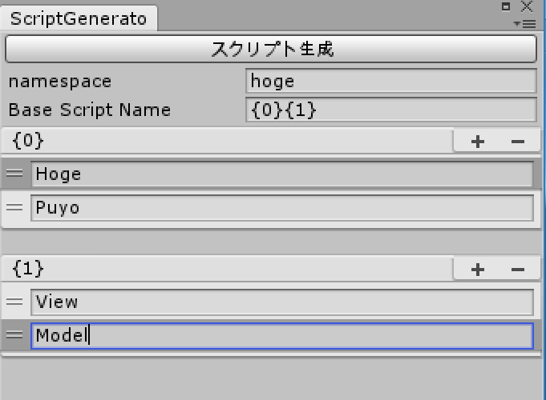

Unity-ScriptGenerator
============
**ScriptGenerator** is a tool to create script files automatically in Unity.

How to use
-------
1) Select "Tools/Script Generator" in the menu.
<br>

<br>
<br>
<br>

2) Enter texts containing custom formatters (e.g. ```Hoge{0}``` )
<br>

<br>
<br>
<br>

3) Click the button.
<br>

<br>

<br>
<br>
That's it!


<br>
<br>
Examples
---

Create **HogeView.cs**, **HogeModel.cs** and **HogePresenter.cs**.
<br>


<br>

Create **HogeView.cs**, **PuyoView.cs**, **HogeModel.cs** and **PuyoModel.cs**.
<br>

<br>
<br>

Script Template File
---
The script files are generated from script template text file.
<br>

<br>
<br>
You can change generated code by editing this one.


Script Generation Rule
---
You can switch script generation rule in Advanced Settings. (since **v1.1**)
<br>


You can switch script template file in the rule ScriptableObject.
<br>


Script Parameter
---
You can pass parameters for generating script files. (since **v2.0**)

step 1: Open the template file (.txt)
<br>

<br>
<br>

step 2: Type parameter within ```#{``` and ```}#``` &ensp;   (e.g.```#{Param1}#```)

<br>
step 3: Select rule Asset in Project Browser.
<br>

<br>

step 4: Type text you want in the inspector panel
<br>

<br>
<br>

step 5: These parameters will be replaced during generating script files.
<br>
For example, generating **HogeFugaPresenter.cs** with this rule, <br>
```#{Param1}#```  will be replaced by  ```HogeFuga```, <br>
```#{Param2}#```  will be replaced by  ```hogeFuga```. <br>


You **cannot** use a number within ```#{``` and ```}#```.<br>
For example, ```#{0}#``` is not supported.

<br>
That's all.

Multiple Rules
---

You can use multiple script generation rules in Advanced Settings. (since **v2.1**).
<br>


<br>
You can create various script files at once.<br>

License
-------
The MIT License (MIT)

Copyright (c) 2016 RNGTM (https://github.com/rngtm)

Permission is hereby granted, free of charge, to any person obtaining a copy of
this software and associated documentation files (the "Software"), to deal in
the Software without restriction, including without limitation the rights to
use, copy, modify, merge, publish, distribute, sublicense, and/or sell copies of
the Software, and to permit persons to whom the Software is furnished to do so,
subject to the following conditions:

The above copyright notice and this permission notice shall be included in all
copies or substantial portions of the Software.

THE SOFTWARE IS PROVIDED "AS IS", WITHOUT WARRANTY OF ANY KIND, EXPRESS OR
IMPLIED, INCLUDING BUT NOT LIMITED TO THE WARRANTIES OF MERCHANTABILITY, FITNESS
FOR A PARTICULAR PURPOSE AND NONINFRINGEMENT. IN NO EVENT SHALL THE AUTHORS OR
COPYRIGHT HOLDERS BE LIABLE FOR ANY CLAIM, DAMAGES OR OTHER LIABILITY, WHETHER
IN AN ACTION OF CONTRACT, TORT OR OTHERWISE, ARISING FROM, OUT OF OR IN
CONNECTION WITH THE SOFTWARE OR THE USE OR OTHER DEALINGS IN THE SOFTWARE.
